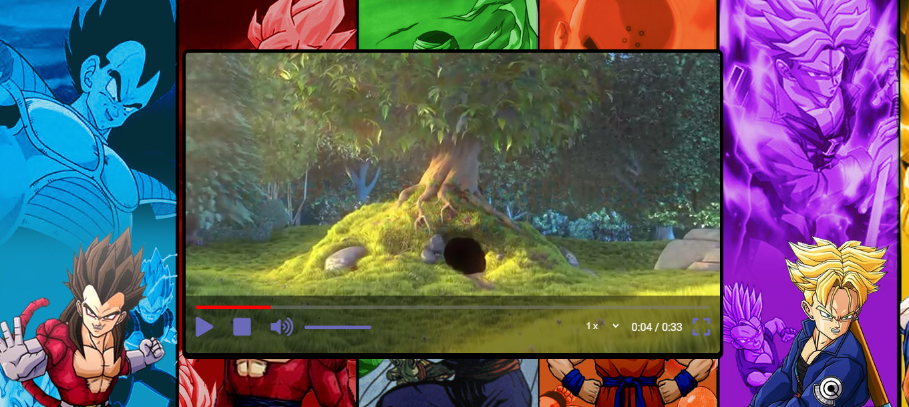

# Player de Video

Este player de video, foi criado utilizando HTML, CSS e Javascript
Utilizando Font Awesome nos icones dos botões

Trabalhamos variaveis em javascript, template literals, funções, metodos, estruturas condicionais if, else, como adicionar eventos, manipulação da DOM, como capturar dados de tempo de execução de video, media queries,
estilização de componentes Html, estrutura Html.

##### Imagem do projeto.
### Funcionalidades
* Play
* Pause
* Stop
* Ajuste de volume do som
* Contador do tempo de execução
* Ajuste de periodo do video
* Ajuste de velocidade de reprodução
* Tela cheia